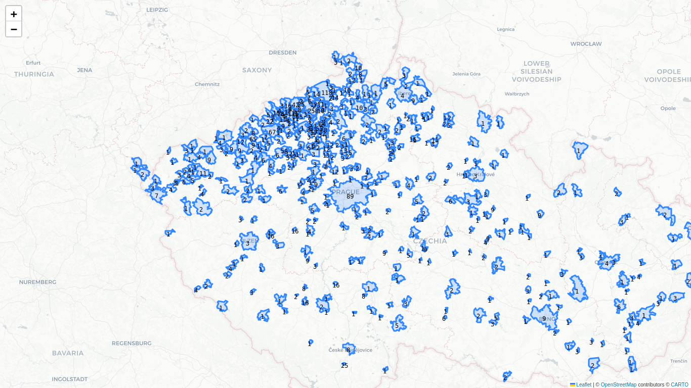
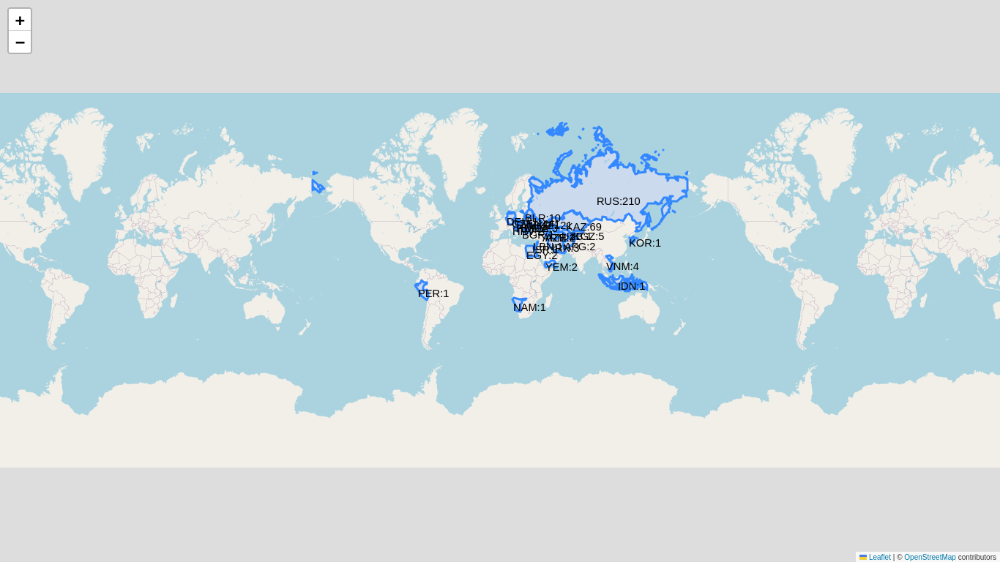

# Analýza uchazečů na UJEP

## Odkazy

- [Oborové skupiny číselník](https://vysledky.cermat.cz/data/PrehledOboruKKOV.aspx)
- [Obory vzdělání](https://cs.wikipedia.org/wiki/Obor_vzd%C4%9Bl%C3%A1n%C3%AD)
- [STAG ciselnik](https://ws.ujep.cz/ws/services/rest2/ciselniky/getCiselnik?domena=OBOR_SS&outputFormat=XLSX)

## Návod k použití

Obrázky map jsou generovány v `podle_mest.ipynb` a `podle_statu.ipynb`.

Prerekvizita ke spuštění je python.
Aplikace se spouští příkazy `pip install -r requirements.txt` a `streamlit run streamlit.py`.

## Galerie

## TODO

- rozdil mezi gymnaziem a lyceem
- <https://www.infoabsolvent.cz/Obory/1#filtr-main>
- <https://www.vyberskoly.cz/jak-se-vyznat-v-kodech-oboru>
